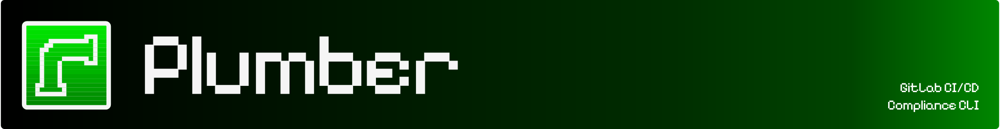

<p align="center">
  
</p>

<p align="center">
  <a href="https://github.com/getplumber/plumber/actions"></a>
  <a href="https://github.com/getplumber/plumber/releases"></a>
  
  <a href="https://github.com/getplumber/plumber/releases"></a>
  <a href="https://hub.docker.com/r/getplumber/plumber"></a>
  <a href="LICENSE"></a>
  <br>
  <br>
  <a href="https://getplumber.io"></a>
  <a href="https://discord.gg/932xkSU24f"></a>
</p>

* Find compliance issues in your GitLab repositories and their CI/CD pipelines
* Download and store compliance results as JSON artifacts for auditability and traceability
* Customize controls

## 📸 Preview

### ✅ Compliance Passed


## Contents

- [Plumber](#-plumber)
- [Preview](#-preview)
- [Quick Start (GitLab CI)](#-quick-start-gitlab-ci)
  - [Self-Hosted GitLab](#%EF%B8%8F-self-hosted-gitlab)
- [Compliance Controls](#-compliance-controls)
- [Customize](#%EF%B8%8F-customize)
  - [All Inputs](#all-inputs)
- [Test Locally (CLI)](#-test-locally-cli)
  - [Download Binary](#download-binary)
  - [Docker](#docker)
  - [Build from Source](#build-from-source)
- [Example Output](#-example-output)
- [Configuration](#-configuration)
- [CLI Reference](#-cli-reference)
- [Troubleshooting](#-troubleshooting)
- [Contributing](#-contributing)
- [License](#-license)

## 🚀 Quick Start (GitLab CI)

**1.** Create a GitLab token with `read_api` + `read_repository` scopes and add it as `GITLAB_TOKEN` in **Settings → CI/CD → Variables** (masked & protected recommended).

**2.** Add to your `.gitlab-ci.yml`:

```yaml
include:
  - component: gitlab.com/getplumber/plumber/plumber@~latest
```

✅ **That's it!** Plumber will analyze your CI/CD pipeline for compliance issues.

> 💡 Everything is customizable — GitLab URL, branch, threshold, and more. See [Customize](#️-customize) below.

### ⚠️ Self-Hosted GitLab

If you're running a self-hosted GitLab instance, you'll need to create your own component since `gitlab.com` components can't be accessed from your instance.

**Option 1:** Fork our [GitLab component](https://gitlab.com/getplumber/plumber) to your instance

**Option 2:** Create a component using [`templates/plumber.yml`](templates/plumber.yml) as a base

See [GitLab's CI/CD component documentation](https://docs.gitlab.com/ee/ci/components/) for setup instructions.

## 🎯 Compliance Controls

Plumber scans your GitLab CI/CD configuration and run following controls:

- 🏷️ **Authorized image tags** — Flags `latest`, `dev`, and other non-reproducible tags for container images used in CI/CD pipelines
- 🔒 **Authorized image sources** — Ensures container images used in your CI/CD pipelines come from approved sources
- 🛡️ **Branch protection** — Verifies that repository branches are properly protected
- Other controls will come

## ⚙️ Customize

Override any input to fit your needs:

```yaml
include:
  - component: gitlab.com/getplumber/plumber/plumber@~latest
    inputs:
      # Target (defaults to current project)
      server_url: https://gitlab.example.com  # Self-hosted GitLab (default: $CI_SERVER_URL)
      project_path: other-group/other-project # Analyze a different project (default: $CI_PROJECT_PATH)
      branch: develop                         # Analyze a specific branch (default: $CI_COMMIT_REF_NAME)

      # Compliance
      threshold: 80                           # Minimum % to pass (default: 100)
      config_file: configs/my-plumber.yaml    # Custom config path (relative to repo root)

      # Output
      output_file: plumber-report.json        # Export JSON report (default: plumber-report.json )
      print_output: true                      # Print to stdout (default: true)

      # Job behavior
      stage: test                             # Run in a different stage (default: .pre)
      allow_failure: true                     # Don't block pipeline on failure (default: false)
      gitlab_token: $MY_CUSTOM_TOKEN          # Use a different variable name (default: $GITLAB_TOKEN)
      verbose: true                           # Enable debug output for troubleshooting (default: false)
```

### All Inputs

| Input | Default | Description |
|-------|---------|-------------|
| `server_url` | `$CI_SERVER_URL` | GitLab instance URL |
| `project_path` | `$CI_PROJECT_PATH` | Project to analyze |
| `branch` | `$CI_COMMIT_REF_NAME` | Branch to analyze |
| `gitlab_token` | `$GITLAB_TOKEN` | GitLab API token (requires `read_api` + `read_repository` scopes) |
| `threshold` | `100` | Minimum compliance % to pass |
| `config_file` | *(auto-detect)* | Path to config file (relative to repo root). Auto-detects `.plumber.yaml` in repo, falls back to default |
| `output_file` | `plumber-report.json` | Path to write JSON results |
| `print_output` | `true` | Print text output to stdout |
| `stage` | `.pre` | Pipeline stage for the job |
| `image` | `getplumber/plumber:0.1` | Docker image to use |
| `allow_failure` | `false` | Allow job to fail without blocking |
| `verbose` | `false` | Enable debug output for troubleshooting |

## 💻 Test Locally (CLI)

### Download Binary

Pre-built binaries are available for each release:

```bash
# Linux (amd64)
curl -LO https://github.com/getplumber/plumber/releases/latest/download/plumber-linux-amd64
chmod +x plumber-linux-amd64
sudo mv plumber-linux-amd64 /usr/local/bin/plumber

# Linux (arm64)
curl -LO https://github.com/getplumber/plumber/releases/latest/download/plumber-linux-arm64
chmod +x plumber-linux-arm64
sudo mv plumber-linux-arm64 /usr/local/bin/plumber

# macOS (Apple Silicon)
curl -LO https://github.com/getplumber/plumber/releases/latest/download/plumber-darwin-arm64
chmod +x plumber-darwin-arm64
sudo mv plumber-darwin-arm64 /usr/local/bin/plumber

# macOS (Intel)
curl -LO https://github.com/getplumber/plumber/releases/latest/download/plumber-darwin-amd64
chmod +x plumber-darwin-amd64
sudo mv plumber-darwin-amd64 /usr/local/bin/plumber

# Windows (PowerShell)
Invoke-WebRequest -Uri https://github.com/getplumber/plumber/releases/latest/download/plumber-windows-amd64.exe -OutFile plumber.exe
```

**Verify checksum** (optional):

```bash
curl -LO https://github.com/getplumber/plumber/releases/latest/download/checksums.txt
sha256sum -c checksums.txt --ignore-missing
```

**Run analysis:**

```bash
export GITLAB_TOKEN=glpat-xxxx
plumber analyze \
  --gitlab-url https://gitlab.com \
  --project mygroup/myproject \
  --branch main \
  --config .plumber.yaml \
  --threshold 100
```

### Docker

```bash
# Run analysis
docker run --rm \
  -e GITLAB_TOKEN=glpat-xxxx \
  getplumber/plumber:latest analyze \
  --gitlab-url https://gitlab.com \
  --project mygroup/myproject \
  --branch main \
  --config /.plumber.yaml \
  --threshold 100

# Save JSON output locally
docker run --rm \
  -e GITLAB_TOKEN=glpat-xxxx \
  -v $(pwd):/output \
  getplumber/plumber:latest analyze \
  --gitlab-url https://gitlab.com \
  --project mygroup/myproject \
  --branch main \
  --config /.plumber.yaml \
  --threshold 100 \
  --output /output/results.json
```

### Build from Source

```bash
git clone https://github.com/getplumber/plumber.git
cd plumber
go build -o plumber .

export GITLAB_TOKEN=glpat-xxxx
./plumber analyze \
  --gitlab-url https://gitlab.com \
  --project mygroup/myproject \
  --branch main \
  --config .plumber.yaml \
  --threshold 100
```

## 📋 Example Output

```
Project: mygroup/myproject

──────────────────────────────────────────────────
Container images must not use forbidden tags (100.0% compliant)
──────────────────────────────────────────────────
  Total Images: 10
  Using Forbidden Tags: 0

──────────────────────────────────────────────────
Container images must come from authorized sources (0.0% compliant)
──────────────────────────────────────────────────
  Total Images: 10
  Authorized: 6
  Unauthorized: 4

  Unauthorized Images Found:
    • Job 'sls_scan' uses unauthorized image: docker.io/shiftleft/sast-scan:v1.15.1
    • Job 'gitleaks' uses unauthorized image: docker.io/zricethezav/gitleaks:v8.15.0
    • Job 'golint' uses unauthorized image: docker.io/docker/golangci-lint:2.5.0-go1.25.3
    • Job 'tag-production-image' uses unauthorized image: gcr.io/go-containerregistry/crane:debug

──────────────────────────────────────────────────
Branch must be protected (100.0% compliant)
──────────────────────────────────────────────────
  Total Branches: 8
  Branches to Protect: 1
  Protected Branches: 1
  Unprotected: 0
  Non-Compliant: 0

────────────────────
Summary
────────────────────

  Status: FAILED ✗

  Issues
  ╔════════════════════════════════════════════════════╤══════════╗
  ║ Control                                            │   Issues ║
  ╟────────────────────────────────────────────────────┼──────────╢
  ║ Container images must not use forbidden tags       │        0 ║
  ║ Container images must come from authorized sources │        4 ║
  ║ Branch must be protected                           │        0 ║
  ╚════════════════════════════════════════════════════╧══════════╝

  Compliance
  ╔════════════════════════════════════════════════════╤════════════╤══════════╗
  ║ Control                                            │ Compliance │   Status ║
  ╟────────────────────────────────────────────────────┼────────────┼──────────╢
  ║ Container images must not use forbidden tags       │     100.0% │        ✓ ║
  ║ Container images must come from authorized sources │       0.0% │        ✗ ║
  ║ Branch must be protected                           │     100.0% │        ✓ ║
  ╟────────────────────────────────────────────────────┼────────────┼──────────╢
  ║ Total (required: 100%)                             │      66.7% │        ✗ ║
  ╚════════════════════════════════════════════════════╧════════════╧══════════╝
```

> 💡 **JSON Output:** When using `--output`, results are saved as JSON. See [`output-example.json`](output-example.json) for the full structure.

## 📝 Configuration

### GitLab CI Component

The component automatically detects your configuration using this priority:

1. **`config_file` input set** → Uses your specified path (relative to repo root)
2. **`.plumber.yaml` in repo root** → Uses your repo's config file
3. **No config found** → Uses the default configuration embedded in the container

### CLI

When using the CLI directly, you must explicitly provide the `--config` flag — there is no auto-detection.

---

To customize controls, create a `.plumber.yaml` file.  
See the [full configuration reference](.plumber.yaml) for all options.

## 🔍 CLI Reference

```
plumber analyze [flags]

Flags:
  --gitlab-url    GitLab instance URL (required)
  --project       Project path, e.g., group/project (required)
  --config        Path to .plumber.yaml (required)
  --threshold     Minimum compliance % to pass (required)
  --branch        Branch to analyze (default: project default)
  --output        Write JSON results to file
  --print         Print text output (default: true)

Environment:
  GITLAB_TOKEN    GitLab API token (required)

Exit Codes:
  0  Passed (compliance ≥ threshold)
  1  Failed (compliance < threshold or error)
```

## 🔧 Troubleshooting

| Issue | Solution |
|-------|----------|
| `GITLAB_TOKEN environment variable is required` | Add `GITLAB_TOKEN` in CI/CD Variables |
| `401 Unauthorized` | Token should have `read_api` + `read_repository` scopes |
| `403 Forbidden` on MR settings | Expected on non-Premium GitLab; continues without that data |

## 🤝 Contributing

Contributions are welcome! Please read our [Contributing Guide](CONTRIBUTING.md) for details on:

- How to report issues
- How to submit pull requests
- Coding and commit conventions
- The review process

## 📄 License

[Elastic License 2.0 (ELv2)](LICENSE) — Free to use. Cannot be offered as a managed service.

