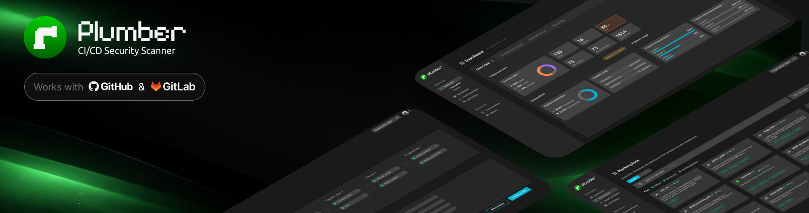
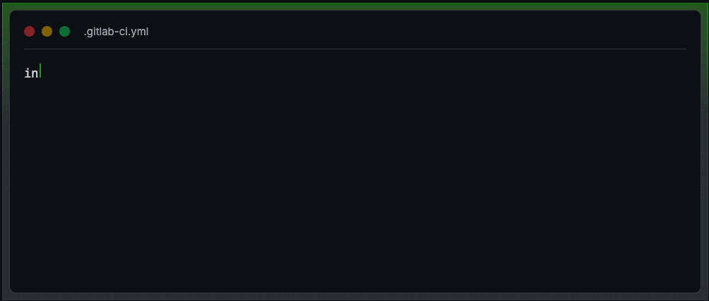
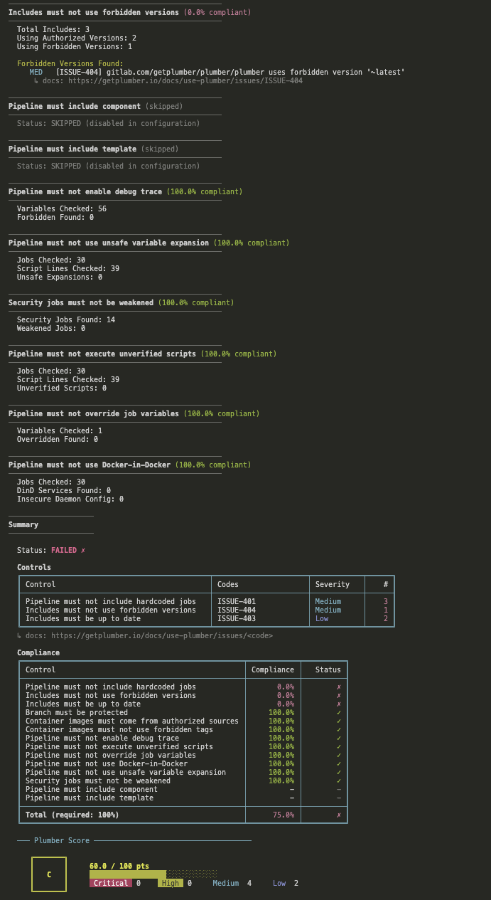

<p align="center">
  
</p>

<p align="center">
  <b>CI/CD security scanner for GitLab CI and GitHub Actions</b><br/>
  <sub>One CLI, one <code>.plumber.yaml</code>, one Rego policy engine.</sub>
</p>

<p align="center">
  <a href="https://score.getplumber.io/github.com/getplumber/plumber"></a>
  &nbsp;&nbsp;
  <a href="https://securityscorecards.dev/viewer/?uri=github.com/getplumber/plumber"></a>
  &nbsp;&nbsp;
  <a href="https://slsa.dev/spec/v1.0/levels#build-l3"></a>
</p>

<p align="center">
  <a href="https://github.com/getplumber/plumber/actions"></a>
  <a href="https://github.com/getplumber/plumber/releases"></a>
  
  <a href="https://github.com/getplumber/plumber/releases"></a>
  <a href="https://hub.docker.com/r/getplumber/plumber"></a>
  <a href="LICENSE"></a>
</p>

<p align="center">
  <a href="https://getplumber.io">Website</a> •
  <a href="https://getplumber.io/docs/cli">Docs</a> •
  <a href="https://discord.gg/932xkSU24f">Discord</a> •
  <a href="https://github.com/getplumber/plumber/issues">Issues</a>
</p>

---

## What Is Plumber?

Plumber scans CI/CD pipelines for risky patterns and security gaps.

- **GitLab CI:** reads `.gitlab-ci.yml`, resolved includes, and repository settings.
- **GitHub Actions:** reads `.github/workflows/*.{yml,yaml}` locally or through the GitHub API.
- **One config:** `.plumber.yaml` contains provider-specific policy sections for GitLab and GitHub.

Plumber reports findings in the terminal, JSON, SARIF, GitLab SAST, PBOM, and CycloneDX formats.

<p align="center">
  
</p>

## Start Here

Run your first scan before reading the full docs.

```bash
brew tap getplumber/plumber
brew install plumber

plumber config generate # generates default configuration yaml file
plumber analyze
```

See the generated default config in this repo: [`.plumber.yaml`](./.plumber.yaml).

Plumber auto-detects the provider from your git remote. Use explicit flags when scanning a repo that is not the current checkout.

## Choose Your Path

| I want to... | Use this | Start here |
|---|---|---|
| Try Plumber locally | CLI | [`plumber analyze`](#local-cli) |
| Add checks to GitLab CI | GitLab CI Component | [GitLab CI Component](#gitlab-ci-component) |
| Add checks to GitHub Actions | GitHub Action | [GitHub Action](#github-action) |
| Audit many repos from a script | CLI + JSON/SARIF | [Outputs](#outputs) |
| Tune policy rules | `.plumber.yaml` | [Configuration](#configuration) |

## Local CLI

### Install

```bash
brew tap getplumber/plumber
brew install plumber
```

Other options:

- `mise use -g github:getplumber/plumber`
- Download a binary from [GitHub Releases](https://github.com/getplumber/plumber/releases)
- Run the Docker image: `getplumber/plumber`

Full install docs:

- GitLab: [getplumber.io/docs/cli/gitlab#run-with-the-gitlab-ci-component](https://getplumber.io/docs/cli/gitlab#run-with-the-gitlab-ci-component)
- GitHub: [getplumber.io/docs/cli/github#run-with-github-actions](https://getplumber.io/docs/cli/github#run-with-github-actions)

### Authenticate

GitLab:

```bash
export GITLAB_TOKEN=glpat_xxxx
```

GitHub (preferred — uses the gh CLI's keyring):

```bash
gh auth login
```

Alternative (CI runners, automation):

```bash
export GH_TOKEN=ghp_xxxx
```

GitHub local scans can run without a token for workflow-content checks. A token enables repo-level and action-metadata checks.

If a workflow uses an action hosted in an org with an IP allow list (which blocks the runner's `GITHUB_TOKEN`), set `PLUMBER_METADATA_TOKEN` to a token with public-repository read so Plumber can still resolve that action's version for the known-CVE check. Without it, Plumber falls back to an anonymous read and, if that is rate-limited too, skips the version check rather than guessing.

### Run

Current repo:

```bash
plumber analyze
```

Specific GitLab project:

```bash
plumber analyze \
  --provider gitlab \
  --gitlab-url https://gitlab.com \
  --project group/project
```

Specific GitHub repo without a local clone:

```bash
plumber analyze \
  --provider github \
  --github-url github.com \
  --project owner/repo
```

## GitHub Action

1. Add [the official Plumber action](https://github.com/marketplace/actions/plumber-score) to `.github/workflows/plumber.yml`:
    ```yaml
    name: Plumber

    on:
      pull_request:
      push:
        branches: [main]

    permissions:
      contents: read
      security-events: write
      # id-token: write   # uncomment to enable score-push below

    jobs:
      plumber:
        runs-on: ubuntu-24.04
        steps:
          - uses: actions/checkout@v6
          - uses: getplumber/plumber@<version>
            with:
              # Set to `true` to publish an official Plumber score badge
              # (it makes your score and repo name public, see Score Push section below)
              score-push: false
    ```


> To resolve action versions hosted in an org with an IP allow list, pass a
> public-repo-read token via the `metadata-token` input (kept in a secret):
>
> ```yaml
>         with:
>           metadata-token: ${{ secrets.PLUMBER_METADATA_TOKEN }}
> ```

**Full guide:** [getplumber.io/docs/cli/github#run-with-github-actions](https://getplumber.io/docs/cli/github#run-with-github-actions)

## GitLab CI Component

1. Add [the official Plumber component](https://gitlab.com/explore/catalog/getplumber/plumber) to `.gitlab-ci.yml`:
    ```yaml
    include:
      - component: gitlab.com/getplumber/plumber/plumber@<version>
        inputs:
          # Set to `true` to publish an official Plumber score badge
          # (it makes your score and repo name public, see Score Push section below)
          score_push: false
    ```
2. Add `GITLAB_TOKEN` in **Settings -> CI/CD -> Variables**.
    Use `read_api` + `read_repository` for scanning, or `api` if you want Plumber to post MR comments or badges.

**Full guide:** [getplumber.io/docs/cli/gitlab#run-with-the-gitlab-ci-component](https://getplumber.io/docs/cli/gitlab#run-with-the-gitlab-ci-component)

## Score Push

Enabling score push publishes a self-updating `A–E` badge to the hosted score
service. It's the only way to get an **official Plumber score**. It's only
available in CI, not when running the CLI locally.

Display it with a badge in your README (swap in your platform/owner/repo):
```md
[](https://score.getplumber.io/github.com/OWNER/REPO)
```

> ⚠️ Opt-in and off by default. Enabling it makes your **score and repository
> name public**. Only the default branch's score is displayed. See [score
> docs](https://getplumber.io/docs/plumber-score).

## Configuration

Plumber reads `.plumber.yaml`.

Create a config interactively:

```bash
plumber config init
```

Generate the full commented [default template](./.plumber.yaml):

```bash
plumber config generate
```

Example:

```yaml
version: "2.0"

gitlab:
  controls:
    containerImageMustNotUseForbiddenTags:
      enabled: true

github:
  controls:
    actionsMustBePinnedByCommitSha:
      enabled: true
      trustedOwners:
        - actions
        - github
```

Useful commands:

```bash
plumber config validate
plumber config view
plumber config diff
plumber explain ISSUE-411
```

Full config reference:

- Default config: [`.plumber.yaml`](./.plumber.yaml)
- CLI docs: [getplumber.io/docs/cli](https://getplumber.io/docs/cli)
- Issue reference: [getplumber.io/docs/use-plumber/issues](https://getplumber.io/docs/use-plumber/issues)

## Controls

Plumber ships controls for:

- container image pinning and authorized sources
- branch protection
- unverified script execution (`curl | bash`, `base64 -d | bash`, etc.)
- Docker-in-Docker
- weakened security jobs
- unsafe variable expansion
- GitHub action pinning, archived actions, ref confusion, and known CVEs
- dangerous GitHub triggers and overbroad permissions
- hardcoded secrets in pipeline YAML (opt-in; shells out to [gitleaks](https://github.com/gitleaks/gitleaks))

Full catalogs:

- GitLab controls: [getplumber.io/docs/use-plumber/controls?p=gitlab](https://getplumber.io/docs/use-plumber/controls?p=gitlab)
- GitHub controls: [getplumber.io/docs/use-plumber/controls?p=github](https://getplumber.io/docs/use-plumber/controls?p=github)

## Outputs

| Output | Flag | Use it for |
|---|---|---|
| Terminal | default | Human review during local or CI runs |
| JSON | `--output results.json` | Automation and dashboards |
| SARIF | `--sarif results.sarif` | GitHub Code Scanning and SARIF-compatible tools |
| GitLab SAST | `--glsast gl-sast-report.json` | GitLab Security Dashboard / MR widget |
| PBOM | `--pbom pbom.json` | Pipeline inventory |
| CycloneDX | `--pbom-cyclonedx cdx.json` | SBOM tooling |

<p align="center">
  
</p>

Example:

```bash
plumber analyze \
  --output results.json \
  --sarif results.sarif \
  --pbom pbom.json \
  --pbom-cyclonedx cdx.json
```

More details:

- PBOM docs: [`docs/PBOM.md`](./docs/PBOM.md)
- Scoring docs: [`docs/scoring.md`](./docs/scoring.md)
- CLI reference: [getplumber.io/docs/cli](https://getplumber.io/docs/cli)

## Exit Codes

| Code | Meaning |
|---|---|
| `0` | The Plumber Score meets the gate (`--min-points` / `--min-score`) |
| `1` | The Plumber Score is below the gate (or the deprecated `--threshold` is not met) |
| `2` | Invalid usage, configuration, or a runtime / provider / auth / network failure |
| `3` | A check could not be verified and `--fail-warnings` is set (e.g. an action version that could not be resolved) |

## Self-Hosted GitLab

If you run a self-hosted GitLab instance, host or mirror the Plumber component inside your instance, publish a release, and include that component URL from your pipelines.

Guide: [getplumber.io/docs/cli/gitlab#hosting-on-self-hosted-gitlab](https://getplumber.io/docs/cli/gitlab#hosting-on-self-hosted-gitlab)

## Troubleshooting

| Problem | What to check |
|---|---|
| `GITLAB_TOKEN environment variable is required` | Export `GITLAB_TOKEN` or add it as a CI/CD variable |
| GitHub upstream scan refuses to start | Set `GH_TOKEN`, `GITHUB_TOKEN`, or run `gh auth login` |
| No GitHub repo-level findings | Local GitHub scans soft-degrade without token/API scope |
| Config warnings | Run `plumber config validate` |
| Need to inspect a finding | Run `plumber explain ISSUE-XXX` |

More help:

- GitLab guide: [getplumber.io/docs/cli/gitlab](https://getplumber.io/docs/cli/gitlab)
- GitHub guide: [getplumber.io/docs/cli/github](https://getplumber.io/docs/cli/github)
- Discord: [discord.gg/932xkSU24f](https://discord.gg/932xkSU24f)
- Contact: [tech@getplumber.io](mailto:tech@getplumber.io)

## Development

Build locally:

```bash
make build
```

Run tests:

```bash
make test
```

Contributing guide: [`CONTRIBUTING.md`](./CONTRIBUTING.md)

## Resources

- Website: [getplumber.io](https://getplumber.io)
- Documentation: [getplumber.io/docs/cli](https://getplumber.io/docs/cli)
- GitHub Action listing: [Plumber Score](https://github.com/marketplace/actions/plumber-score)
- GitLab component docs: [`COMPONENT_README.md`](./COMPONENT_README.md)
- Security policy: [`SECURITY.md`](./SECURITY.md)

## License

Plumber is licensed under the [Mozilla Public License 2.0](LICENSE).
